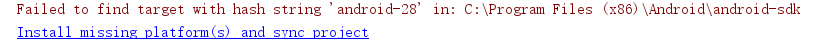
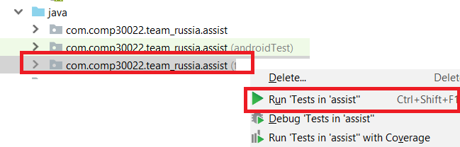

# Russia Client


## Prerequisite
 - Android Studio

## Building

### With Android Studio
1. Clone this repository locally.

1. In Android Studio, select menu item `File -> Open...` and open the root of your local repository.

1. Android Studio will prompt you to install missing SDKs. On Windows, you will need to run Android Studio as Administrator to install SDKs.
   

1. To build and run the app, select menu item `Run -> Run` and then in the popup dialog, select `app`.

#### Configure the Android Emulator (The First Time)
1. First, be sure the Project window is open (select View > Tool Windows > Project) and the Android view is selected from the drop-down list at the top of that window. 

1. Click the 'app' module in the Project window and then select Run > Run (or click Run in the toolbar).

1. In the Select Deployment Target window, click Create New Virtual Device.

1. In the Select Hardware screen, select 'Nexus 4' as your phone device, and then click Next.

1. In the System Image screen, select 'API 27' (Android 8.1 Oreo) as the version. (Note: If you don't have that version installed, a Download link is shown, so click that and complete the download.) Click Next.

1. On the Android Virtual Device (AVD) screen, leave all the settings alone and click Finish.

1. Check "Use same selection for future launches"

1. Back in the Select Deployment Target dialog, select the device you just created and click OK.

1. Now, the emulator should be displayed.

#### Running the Android Emulator (Subsequent Run's)
1. For subsequent run's of the emulator, while having the emulator running, just click "Apply changes"
 
### From command line (Linux)
```bash
./gradlew assembleDebug
```

## Running Tests
There are two types of tests: 

1. Unit tests, located in `src/test/java/com/comp30022/team_russia/assist`

1. Android Instrumented Tests, located in `src/androidTest/java/com/comp30022/team_russia/assist` (Runs on a physical phone or an Android emulator.)

### In Android Studio
To run either type of tests, right click on the corresponding folder in the "Project" panel, then select `Run 'Tests in 'assist''`.


