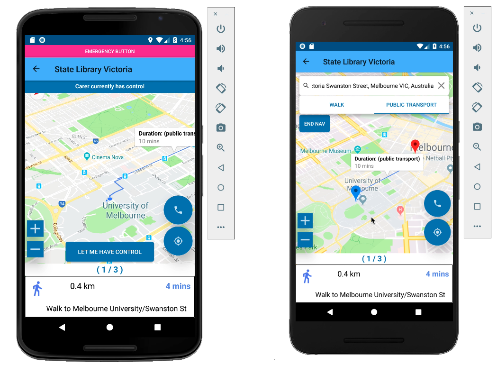

# Russia Client
Client repository for Team Russia.

Please note that this repository was made for educational purposes,
as part of assessment for the subject
[IT Project (COMP30022)](https://handbook.unimelb.edu.au/subjects/comp30022). 
It has not been tested and is **not** intended for use in production environments.

## Prerequisite
 - Android Studio 3.2
 - Android phone or emulator with minimal API level 26
 - Google API Key with Places API, Maps API & Directions API enabled
 - Include google-services.json (from Firebase) in app
 - Include secrets.xml in res/values
   ```
   <?xml version="1.0" encoding="utf-8"?>
   <resources>
       <string name="api_key">
          google-api-key
       </string>
   </resources>
   ```
  - Update config.properties with the correct Server URL and Jitsi Meet URL. 

> Note to COMP30022 teaching team: we will send you the pre-configured copies for the above files via email.
 
## Code Structure

- [`app/src/main/java/com/comp30022/team_russia/assist/`](app/src/main/java/com/comp30022/team_russia/assist) contains the majority of our implementation:
  - The `base` subpackage contains supporting classes for the entire application, including:
    - `base.di`: Dependency Injection (Dagger) definitions
    - `base.persist`: Simple key-value persistence
    - `base.db`: Room Database (SQLite)
    - `base.pubsub`: In-process message bus, or Publisher-Subscriber Hub.
  - The user-facing features are grouped into subpackages inside the `features` package, including:
    > Note: these subpackages are rough grouping of the features for code separation. They _do not_ have one-to-one correspondence with the features defined in our Requirement Document.
    - `assoc`: UI and logic for making account associations (AP-Carer).
    - `call`: Voice call and AP camera viewing
    - `chat`: Text chat, including Pictures-in-chat.
    - `emergency`: AP's Emergency notification.
    - `home`: Home screen & contact list.
    - `location`: Real-time location sharing.
    - `media`: Media file management and caching.
    - `nav`: Carer-assisted, turn-by-turn navigation feature.
    - `profile`: User profile UI and logic.
    - `push`: Out-of-app push notificiation & real-time server-push mechanisms.
  - Inside each of these `features.*` packages, there are a number of subpackages, named accordingly:
    - `features.*.services`: contains the Service / Business Logic layer code.
    - `features.*.ui`: contains the Android-specific UI classes (e.g. `Activity` and `Fragment`).
    - `features.*.vm`: contains the View Models.
    - `features.*.models`: contains domain objects and Data Transfer Objects.
    - `features.*.db`: contains local database-related classes, including schema and Data Access Objects.
    - `features.*.sys`: contains other Android-system level components, such as `BroadcastReceiver` and Android background Service.
 - [`app/src/test/java/com/comp30022/team_russia/assist/`](app/src/test/java/com/comp30022/team_russia/assist) contains the Unit tests.

## Building

### With Android Studio
1. Clone this repository locally.

1. In Android Studio, select menu item `File -> Open...` and open the root of your local repository.

1. Android Studio will prompt you to install missing SDKs. On Windows, you will need to run Android Studio as Administrator to install SDKs.
   

1. To build and run the app, select menu item `Run -> Run` and then in the popup dialog, select `app`.

#### Configure the Android Emulator (The First Time)
1. First, be sure the Project window is open (select View > Tool Windows > Project) and the Android view is selected from the drop-down list at the top of that window. 

1. Click the 'app' module in the Project window and then select Run > Run (or click Run in the toolbar).

1. In the Select Deployment Target window, click Create New Virtual Device.

1. In the Select Hardware screen, select 'Nexus 4' as your phone device, and then click Next.

1. In the System Image screen, select 'API 27' (Android 8.1 Oreo) as the version. (Note: If you don't have that version installed, a Download link is shown, so click that and complete the download.) Click Next.

1. On the Android Virtual Device (AVD) screen, leave all the settings alone and click Finish.

1. Check "Use same selection for future launches"

1. Back in the Select Deployment Target dialog, select the device you just created and click OK.

1. Now, the emulator should be displayed.

#### Running the Android Emulator (Subsequent Run's)
1. For subsequent run's of the emulator, while having the emulator running, just click "Apply changes"
 
### From command line (Linux)
```bash
./gradlew assembleDebug
```

## Running Tests
There are two types of tests: 

1. Unit tests, located in `src/test/java/com/comp30022/team_russia/assist`

1. Android Instrumented Tests, located in `src/androidTest/java/com/comp30022/team_russia/assist` (Runs on a physical phone or an Android emulator.)

### In Android Studio
To run either type of tests, right click on the corresponding folder in the "Project" panel, then select `Run 'Tests in 'assist''`.


### Youtube Demo

<a href="https://www.youtube.com/watch?v=PuSn63CUYQw" align="center">
  
</a>

